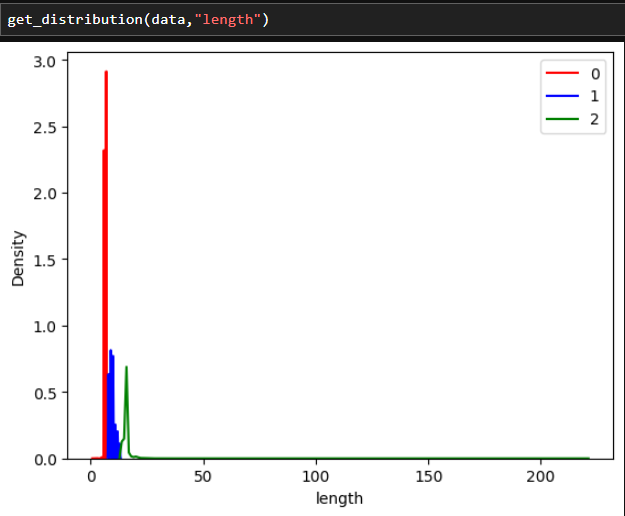
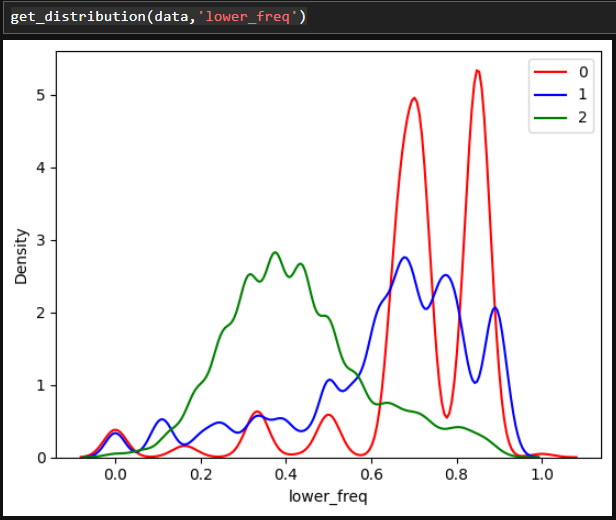
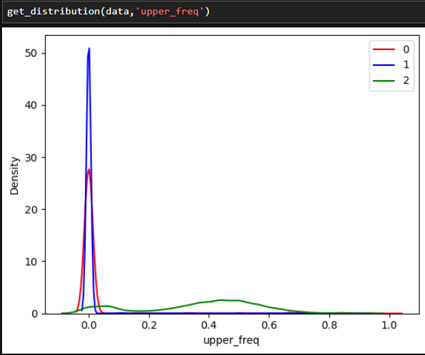
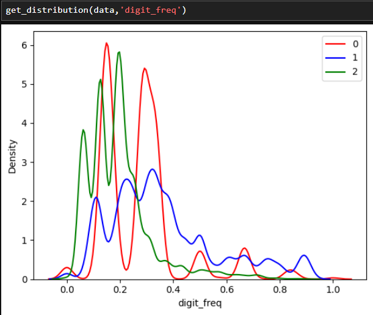
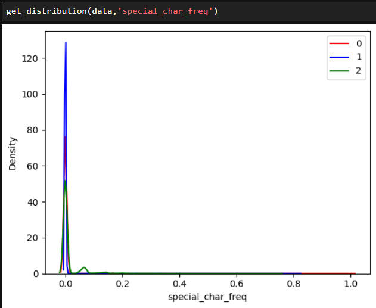
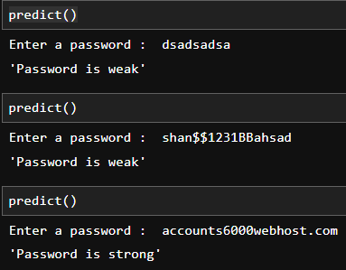

# Password Strength Prediction Project

## Overview
This project aims to predict the strength of a password based on various features such as length, character frequency, and special characters. It uses machine learning techniques to classify passwords into three categories: weak, normal, and strong.

## Features
- Password strength classification based on five key factors:
  - Length of the password
  - Frequency of lowercase characters
  - Frequency of uppercase characters
  - Frequency of numeric characters
  - Frequency of special characters

## Installation
To run this project, follow these steps:

1. Clone the repository:
   ```bash
   git clone git clone https://github.com/VelvetDragon/Password-Strength-Prediction-using-NLP.git
   ```

2. Navigate to the project directory:
   ```bash
   cd Password-Strength-Prediction-using-NLP
   ```

3. Install the required packages:
   ```bash
   pip install pandas numpy matplotlib seaborn scikit-learn
   ```

4. Make sure you have the SQLite database (`password_data.sqlite`) in the project directory.

## Usage
1. Run the Jupyter Notebook `password_strength_prediction.ipynb`.
2. Call the `predict()` function and enter a password when prompted to check its strength.

### Example:
```python
predict()  # Enter your password when prompted
```

## Data
The project uses a SQLite database (`password_data.sqlite`) containing user passwords and their corresponding strength labels. The data is loaded into a Pandas DataFrame for analysis.

## Data Analysis
The project includes:
- Data cleaning and preprocessing
- Semantic analysis to categorize passwords based on their characteristics
- Feature engineering to extract relevant features from the password
- Data visualization using box plots and distribution plots

### Distribution Plots
The distribution plots for various features, including the length and frequency of lowercase characters, help visualize how these factors contribute to password strength. Here’s an example of the distribution plots generated during analysis:

 






## Model Training
The model is trained using:
- Logistic Regression to classify password strength based on the engineered features.

## Predictions
The model allows users to input passwords and receive real-time predictions regarding their strength.



## Acknowledgments
- [Scikit-learn](https://scikit-learn.org/stable/) for machine learning tools.
- [Pandas](https://pandas.pydata.org/) for data manipulation and analysis.
- [Matplotlib](https://matplotlib.org/) and [Seaborn](https://seaborn.pydata.org/) for data visualization.
